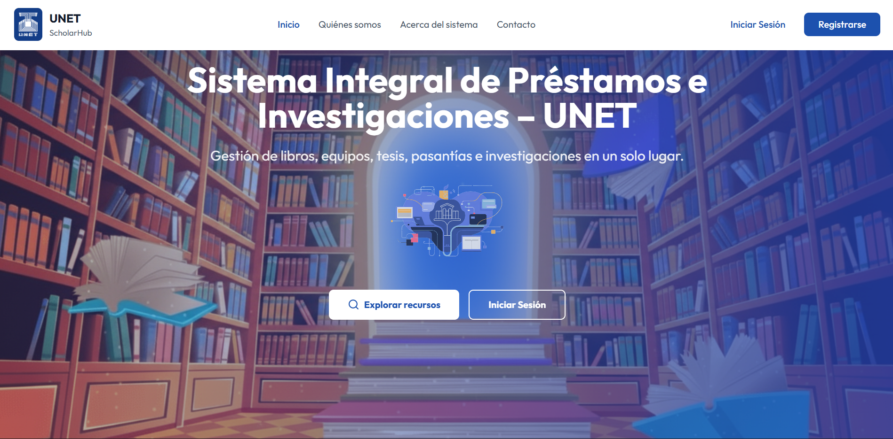
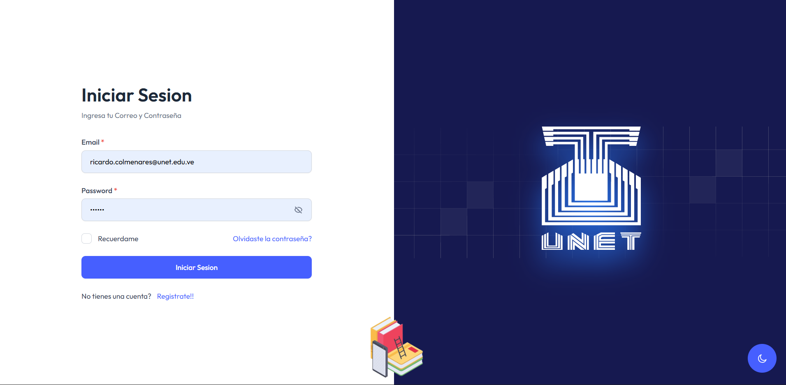
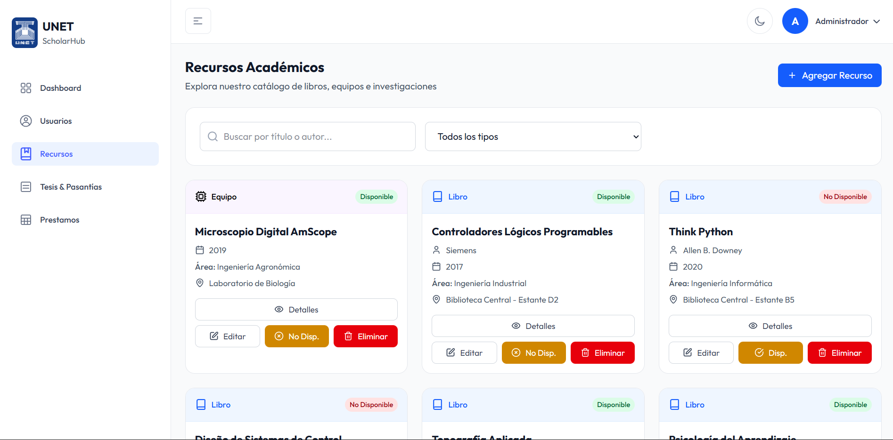
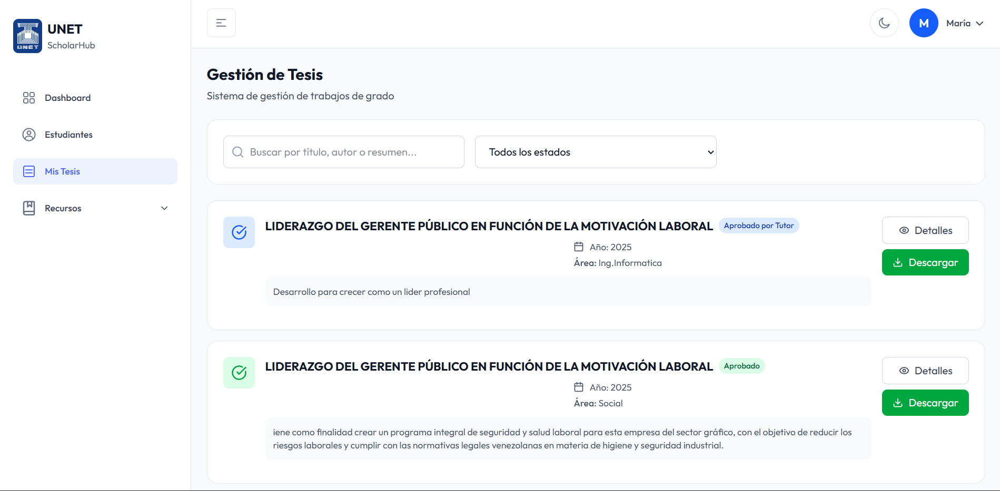

<div align="center">
  
</div>
<div align="center">

  []()
  []()
  []()
  []()
  []()

</div>

---

### 📘 Descripción del Proyecto

**ScholarHub** es una solución tecnológica integral diseñada para la **UNET**, cuyo propósito es centralizar y modernizar la gestión de recursos académicos. El sistema facilita el control de préstamos (libros, equipos y herramientas), integra un seguimiento detallado para tesis y pasantías, y utiliza algoritmos inteligentes para mejorar la experiencia educativa.

> *"Promoviendo la innovación y mejorando la transparencia en la administración académica y de recursos."*

### 🚀 Módulos Principales

El sistema está compuesto por 5 módulos clave diseñados para cubrir las necesidades de estudiantes, docentes y administrativos:

| Módulo | Funcionalidad Clave |
| :--- | :--- |
| **📚 Inventario y Préstamos** | Gestión centralizada de préstamos y devoluciones de libros, equipos de laboratorio y herramientas. |
| **🎓 Gestión de Tesis** | Repositorio digital, registro de propuestas y seguimiento de avances de trabajos de grado. |
| **💼 Gestión de Pasantías** | Control de horas, registro de empresas aliadas y supervisión de tutores académicos/empresariales. |
| **🤖 Recomendaciones IA** | Sistema inteligente que sugiere libros, artículos y equipos según el perfil e intereses del estudiante. |
| **⚙️ Administración** | Panel de control total para gestión de usuarios (Roles RBAC), recursos, políticas y estadísticas. |

---

### 📸 Galería de Mockups

_Vistas preliminares de la interfaz de usuario._

| **Pagina Principal** | **Login** |
| :---: | :---: |
|   | |
| *Vista General al ingresar a la pagina* | *Acceso seguro al sistema* |

| **Inventario** | **Seguimiento Tesis** |
| :---: | :---: |
|  |  |
| *Catálogo de recursos disponibles* | *Línea de tiempo de entregas* |


### 🗄️ Estructura de Datos (ERD)

El sistema maneja una base de datos relacional robusta con las siguientes entidades principales:

* **Usuarios:** Gestión de roles (Administrador, Bibliotecario, Estudiante, Docente).
* **Recursos:** Inventario físico con estados y ubicación.
* **Préstamos:** Registro histórico y activo de circulante.
* **Tesis/Pasantías:** Tablas vinculantes para el seguimiento académico.
* **Recomendaciones:** Motor de sugerencias personalizado.

---

### 💻 Instalación y Despliegue

Este proyecto utiliza **Vite** con React y Tailwind CSS. Sigue estos pasos para ejecutarlo localmente:

1.  **Clonar el repositorio:**
    ```bash
    git clone [https://github.com/tu-usuario/scholarhub-unet.git](https://github.com/tu-usuario/scholarhub-unet.git)
    cd scholarhub-unet
    ```

2.  **Instalar dependencias:**
    ```bash
    npm install
    ```

3.  **Configurar Variables de Entorno:**
    Crea un archivo `.env` en la raíz basado en `.env.example`.

4.  **Iniciar servidor de desarrollo:**
    ```bash
    npm run dev
    ```

---

<div align="center">
  <sub>Desarrollado por Ricardo Colmenares | UNET 2025</sub>
</div>
